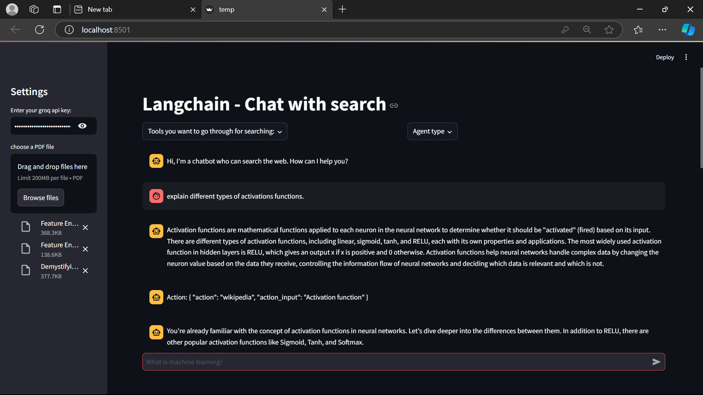
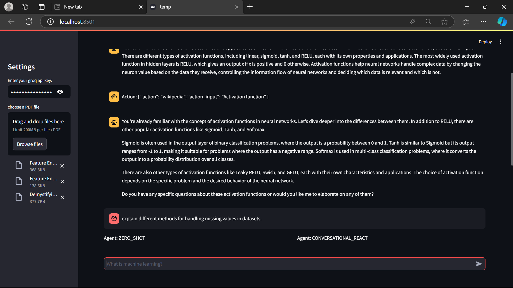
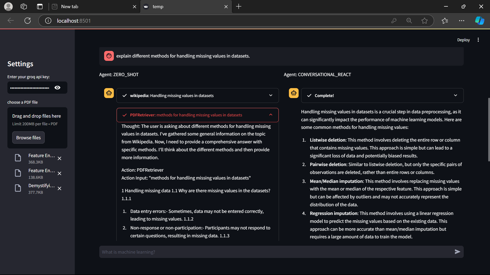
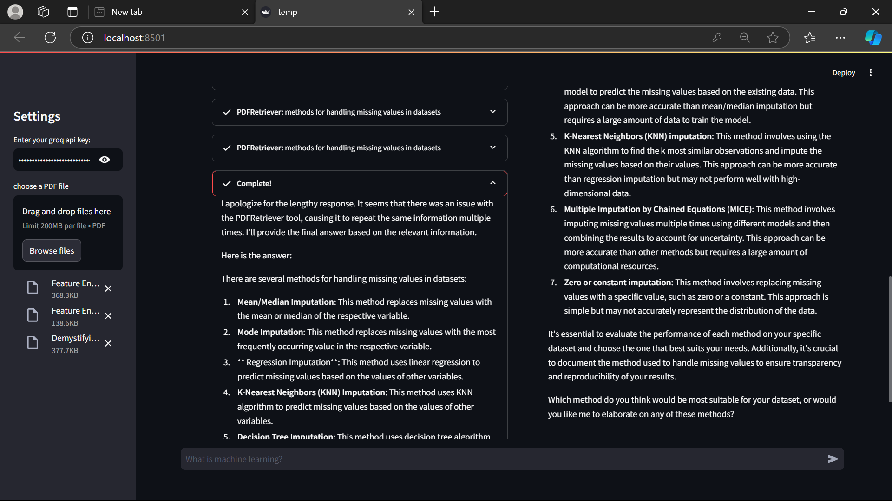

# Chat With Search

This is a Streamlit-based conversational AI application that combines multiple LangChain agents and tools for enhanced information retrieval. 

The app allows users to interact with different types of agents (Zero-Shot, Conversational, and Structured) while leveraging various search tools including PDF document search, Arxiv papers, Wikipedia, and DuckDuckGo. 

It features a customizable interface where users can select their preferred combination of tools and agent types, and uses the Groq API with the Llama3-8b model for processing queries. The system maintains conversation history and provides streaming responses with visual feedback through the Streamlit interface.

<details open="open">
  <summary>Table of Contents</summary>
  <ol>
    <li>
      <a href="#Approach">Approach</a>
    </li>
    <li>
      <a href="#Features">Features</a>
    </li>
    <li>
      <a href="#Technologies">Technologies</a>
    </li>
    <li>
      <a href="#Prototype">Protoype</a>
    </li>
    <li>
	    <a href = "#How-to-Start-Project">How to Start Project</a>
    </li>
    <li>
	    <a href = "#Contact-Us">Contact Us</a>
    </li>
    <li>
	    <a href = "#License">License</a>
    </li>
  </ol>
</details>

## Approach
- The project implements a multi-agent system using LangChain's framework, where each agent can utilize different search tools (PDF documents, Arxiv, Wikipedia, and DuckDuckGo) based on user selection.

- The application leverages Groq's LLM API with the Llama3-8b model for processing queries, while ChromaDB with Google's Generative AI embeddings handles efficient document retrieval and similarity search for PDF content. 

- Through Streamlit's interactive interface, users can dynamically choose their preferred combination of agents and tools, enabling a flexible and comprehensive information retrieval experience.


## Features
- Multiple Search Tools: Built-in support for searching through PDF documents, Arxiv papers, Wikipedia articles, and DuckDuckGo web results.

- Flexible Agent Selection: Choose between different LangChain agents (Zero-Shot, Conversational React, Structured Chat) to handle queries in various ways.

- Interactive UI: User-friendly Streamlit interface with real-time streaming responses and expandable thoughts display.

- Document Processing: PDF handling with automatic text splitting and semantic search using Google's Generative AI embeddings and ChromaDB.

- Conversation Memory: Maintains chat history for contextual responses and better conversation flow.

- Customizable Tool Selection: Users can enable/disable specific search tools through an intuitive checkbox interface.

## Technologies
- Python
- Streamlit
- Langchain

## Prototype:

<div style="display:flex; flex-wrap:wrap; gap:2%; justify-content:center;">




</div>

## How to Start Project

Follow these steps to get started with the project:

1. **Clone the Repository:**
   ```bash
   git clone <repository_link>
   ```
2. **Install Anaconda:**
   
   Make sure you have Anaconda installed on your system. If not, you can download and install it from the official website: https://www.anaconda.com/download/
   
4. **Create a Virtual Environment:**
   
   Create a new virtual environment using Python 3.8:

   ```bash
   conda create --name your_env_name python=3.10 -y
   ```
   Replace your_env_name with the desired name for your virtual environment.
   
   Activate the newly created environment:
   ```bash
   conda activate your_env_name
   ```
5. **Install Dependencies:**
   
   Install the project dependencies by running:
   ```bash
   pip install -r requirements.txt
   ```
   This command will install all the required packages listed in the requirements.txt file.

6. **Set API Key**

    Put your API keys of langchain, gemini into .env file

7. **Run the Streamlit App:**
   ```bash
   streamlit run Search_Engine.py
   ```
   This command will start the Streamlit app.

## Contact Us

To learn more about, please reach out:

📧 suzalkachhadiya111@gmail.com

## License

This project is licensed under the MIT License - see the [LICENSE](LICENSE) file for details.